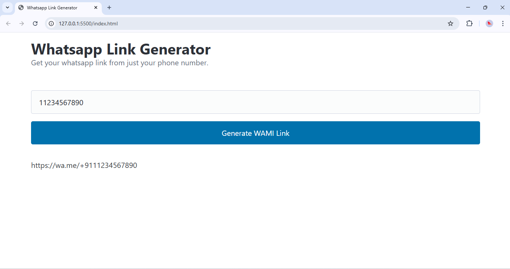

# WAConnect – A WhatsApp Link Generator

Generate a WhatsApp link from just a phone number with this simple web tool. This tool allows users to quickly create a `https://wa.me` link that can be shared or bookmarked for initiating a WhatsApp chat directly.

## 🌐 Demo

You can try it out locally by opening `index.html` in your browser.

---

## 📁 Project Structure

```
WAConnect/
├── assets/
│   ├── css/
│   │   └── main.css       # Styles for layout
│   ├── img/
│   │   └── Screenshot-wami.png
│   └── js/
│       └── main.js        # JavaScript for link generation
├── index.html             # Main HTML structure and UI
├── README.md              # Project documentation
├── License.md             # License file
└── .gitignore             # Git ignored files
```

---

## 🚀 Features

- ✅ Enter a phone number to generate a WhatsApp link.
- ✅ Click to generate the link instantly.
- ✅ Built with HTML, CSS, and JavaScript.
- ✅ Clean, responsive UI using [Pico CSS](https://picocss.com/).

---

## 📸 Screenshot

 <!-- Replace with actual screenshot if desired -->

---

## 🔧 Usage

1. Open the `index.html` file in a browser.
2. Enter a valid WhatsApp number (currently hardcoded for +91 country code).
3. Click "Generate WAMI Link".
4. Your WhatsApp link will appear below the button.

Example output:

https://wa.me/+911234567890

---

## 🛠 Tech Stack

- HTML5
- Vanilla JavaScript
- Pico CSS (CDN)

---

## 📦 Installation (for Developers)

You can clone this repo locally:

```bash
git clone https://github.com/your-username/WAConnect.git
cd WAConnect

```

Then open `index.html` in your browser.

> Note: No build tools or dependencies required.

---

## 📌 Customization

You can modify the `getWhatsappUrl` function in `assets/js/main.js` to allow input of different country codes if needed:

````

```js
function getWhatsappUrl(whatsappUser) {
  return "https://wa.me/" + whatsappUser; // Remove "+91"
}
````

---

## 🧾 License

This project is licensed under the terms described in `License.md`.

---

## 🙌 Contributing

Contributions, issues, and feature requests are welcome!

1. Fork the repository
2. Create your branch (`git checkout -b feature/something`)
3. Commit your changes (`git commit -am 'Add something'`)
4. Push to the branch (`git push origin feature/something`)
5. Create a new Pull Request

---

## 📬 Contact

For any questions or suggestions, feel free to reach out via [GitHub Issues](https://github.com/your-username/WAConnect/issues).

---

Enjoy using the **WAConnect**!

```

---

Let me know if you want this version to include:

- Support for different country codes,
- A copy-to-clipboard button,
- Hosting options (GitHub Pages, Netlify),
  or anything else!
```
